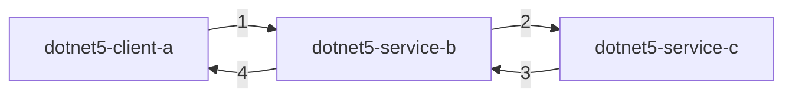

## 版本介绍

- Dotnet 版本：5.0.100
- Dapr dotnet 版本：0.12.0-preview01

**注意:** `Asp.Net Core` 项目中的 launchSettings.json 文件，该文件的中的端口号应和 darp --app-port 端口号相同，否则 dapr 无法正常启动 `Asp.Net Core` 项目。


## 工程结构


3 个 .NET 5 项目，ClientA、ServiceB、ServiceC。1 个 .NET Standard 项目，Dtos 。Dtos 用于存储各种传输模型。调用路径如下图所示。新建两个 service 的意义在于展示 http 链路调用通过 dapr 如何实现。



1. dotnet5-client-a 做为客户端调用服务 dotnet5-service-b;
2. dotnet5-service-b 做为服务中转，既收来自 dotnet5-client-a 客户端的请求，又发起对 dotnet5-service-c 的调用;
3. dotnet5-service-c 响应 dotnet5-service-b 的请求；
4. dotnet5-service-b 响应 dotnet5-client-a 的请求。

## ServiceC

ServiceC 做为 http 调用链路调用终端只需监听 http 调用端口。通过 nuget 包管理工具，选中->Show pre-release packages，搜索 dapr ，选中 Dapr.AspNetCore 安装包。

### Startup

在 ConfigureServices(IServiceCollection services) 方法中通过链式调用 AddDapr() 方法注册 Dapr 到 IOC 容器中。内容如下：

``` c#
using System.Text.Json;
using Microsoft.AspNetCore.Builder;
using Microsoft.AspNetCore.Hosting;
using Microsoft.Extensions.Configuration;
using Microsoft.Extensions.DependencyInjection;
using Microsoft.Extensions.Hosting;

namespace ServiceC
{
    public class Startup
    {
        public Startup(IConfiguration configuration)
        {
            Configuration = configuration;
        }

        public IConfiguration Configuration { get; }

        // This method gets called by the runtime. Use this method to add services to the container.
        public void ConfigureServices(IServiceCollection services)
        {
            services.AddControllers().AddDapr().AddJsonOptions(options => {
                options.JsonSerializerOptions.PropertyNamingPolicy = JsonNamingPolicy.CamelCase;
                options.JsonSerializerOptions.PropertyNameCaseInsensitive = true;
            }
            );
        }

        // This method gets called by the runtime. Use this method to configure the HTTP request pipeline.
        public void Configure(IApplicationBuilder app, IWebHostEnvironment env)
        {
            if (env.IsDevelopment())
            {
                app.UseDeveloperExceptionPage();
            }

            app.UseRouting();
            app.UseAuthorization();

            app.UseEndpoints(endpoints =>
            {
                endpoints.MapControllers();
            });
        }
    }
}

```

### HelloController

在 HelloController 中添加 Talk 方法，打印接收的信息并告诉调用方当前服务是谁。具体内容如下：

``` c#
[ApiController]
public class HelloController : Controller
{
    [HttpPost("talk")]
    public async Task<SomeResponseBody> Talk(SomeRequestBody someRequestBody)
    {
        Console.WriteLine(string.Format("{0}:{1}", someRequestBody.Id, someRequestBody.Time));
        return await Task.FromResult(new SomeResponseBody
        {
            Msg = "This is ServiceC"
        });
    }
}
```

### launchSetting.json

profiles.ServiceC.applicationUrl 端口号一定要修改为 --app-port 相同的端口号，否则通过 dapr 启动项目的时候无法正常启动

``` json
{
  "$schema": "http://json.schemastore.org/launchsettings.json",
  "iisSettings": {
    "windowsAuthentication": false,
    "anonymousAuthentication": true,
    "iisExpress": {
      "applicationUrl": "http://localhost:35737",
      "sslPort": 44379
    }
  },
  "profiles": {
    "IIS Express": {
      "commandName": "IISExpress",
      "launchBrowser": true,
      "launchUrl": "swagger",
      "environmentVariables": {
        "ASPNETCORE_ENVIRONMENT": "Development"
      }
    },
    "ServiceC": {
      "commandName": "Project",
      "launchBrowser": true,
      "launchUrl": "swagger",
      "applicationUrl": "http://localhost:9201",
      "environmentVariables": {
        "ASPNETCORE_ENVIRONMENT": "Development"
      }
    }
  }
}
```

### 启动

``` cmd
dapr run --app-id dotnet-server-c --app-port 9201 --dapr-http-port 3520 dotnet run
```

## ServiceB

ServiceB 做为调用链中的一个中转节点，既要监听服务，同时还要发起请求。由于 `Dapr.AspNetCore` 已经引用了 `Dapr.Client` 。因此不需要再次引用 `Dapr.Client`。

### Startup

下面是 Dapr.AspNetCore AddDapr() [源码](https://github.com/dapr/dotnet-sdk/blob/master/src/Dapr.AspNetCore/DaprMvcBuilderExtensions.cs)，从源码中可知 AddDapr() 方法向控制器中注册 Dapr 集成。同时通过依赖注入容器注册 DaprClient 。DaprClient 可以和 Dapr 运行时交互。比如 HTTP 调用,也正因为如此，ServiceB 的 Startup 文件我们只需拷贝 ServiceC 的 Startup 文件即可。源码如下：

``` c#
/// <summary>
/// Provides extension methods for <see cref="IMvcBuilder" />.
/// </summary>
public static class DaprMvcBuilderExtensions
{
    /// <summary>
    /// Adds Dapr integration for MVC to the provided <see cref="IMvcBuilder" />.
    /// </summary>
    /// <param name="builder">The <see cref="IMvcBuilder" />.</param>
    /// <param name="configureClient">The (optional) <see cref="DaprClientBuilder" /> to use for configuring the DaprClient.</param>
    /// <returns>The <see cref="IMvcBuilder" /> builder.</returns>
    public static IMvcBuilder AddDapr(this IMvcBuilder builder, Action<DaprClientBuilder> configureClient = null)
    {
        if (builder is null)
        {
            throw new ArgumentNullException(nameof(builder));
        }

        // This pattern prevents registering services multiple times in the case AddDapr is called
        // by non-user-code.
        if (builder.Services.Any(s => s.ImplementationType == typeof(DaprMvcMarkerService)))
        {
            return builder;
        }

        builder.Services.AddDaprClient(configureClient);

        builder.Services.AddSingleton<DaprMvcMarkerService>();
        builder.Services.AddSingleton<IApplicationModelProvider, StateEntryApplicationModelProvider>();
        builder.Services.Configure<MvcOptions>(options =>
        {
            options.ModelBinderProviders.Insert(0, new StateEntryModelBinderProvider());
        });

        return builder;
    }

    private class DaprMvcMarkerService
    {
    }
}
```

### HelloController

通过构造器注入 DaprClient 以发起 Http 调用 ServiceC 提供的服务。

``` c#
[ApiController]
public class HelloController : ControllerBase
{

    private readonly DaprClient daprClient;

    public HelloController(DaprClient daprClient)
    {
        this.daprClient = daprClient;
    }

    [HttpPost("talk")]
    public async Task<SomeResponseBody> Talk(SomeRequestBody someRequestBody)
    {
        var data = new { Time = DateTime.Now.ToLongDateString(), Id = "This is Service C." };
        HTTPExtension httpExtension = new HTTPExtension()
        {
            Verb = HTTPVerb.Post
        };
        SomeResponseBody responseBody = await daprClient.InvokeMethodAsync<object, SomeResponseBody>("dotnet-server-c", "talk", data, httpExtension);

        Console.WriteLine(string.Format("{0}:{1} \n recieve message:{2}", someRequestBody.Id, someRequestBody.Time, responseBody.Msg));
        return await Task.FromResult(new SomeResponseBody
        {
            Msg = "This is ServiceB"
        });
    }
```

### launchSetting.json

参考 ServiceC 更改端口号。

### 启动

``` cmd
dapr run --app-id dotnet-server-b --app-port 9200 --dapr-http-port 3521 dotnet run
```

## ClientA

ClientA 的目的是发起对 ServiceB 服务的调用，因此只需添加 `Dapr.Client` 用于和 Dapr 运行时交互即可。内容如下：

``` c#
class Program
    {
        static async Task Main(string[] args)
        {
            var jsonOptions = new JsonSerializerOptions()
            {
                PropertyNamingPolicy = JsonNamingPolicy.CamelCase,
                PropertyNameCaseInsensitive = true,
            };

            var client = new DaprClientBuilder()
                .UseJsonSerializationOptions(jsonOptions)
                .Build();

            var data = new { Time = DateTime.Now.ToLongDateString(), Id="This is Client A" };
            HTTPExtension httpExtension = new HTTPExtension()
            {
                Verb = HTTPVerb.Post
            };
            while (true)
            {
                var a = await client.InvokeMethodAsync<object, SomeResponseBody>("dotnet-server-b", "talk", data, httpExtension);
                Console.WriteLine(a.Msg);
                await Task.Delay(5 * 1000);
            }
        }
    }
```

每间隔 5 秒向 ServiceB 发送一次请求。

### 启动

``` cmd
dapr run --app-id dotnet5-http-client dotnet run
```

ClientA 接收内容:

``` cmd
== APP == This is ServiceB
```

SerivceB 接收内容:

``` cmd
== APP == This is Client A:2020年11月27日 星期五

== APP ==  recieve message:This is ServiceC
```

ServiceC 接收内容:

``` cmd
== APP == This is Service C.:2020年11月27日 星期五
```

## 总结

至此，DOTNET5 通过 dapr HTTP 调用的示例就结束了。


