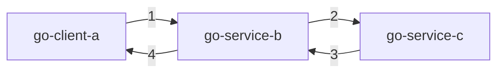

## 版本介绍

- Go 版本：1.15
- Dapr Go SKD 版本：0.11.1

## 工程结构


从上图可知，新建 3 个 Go 启动项目,cmd 为启动项目目录，其中 client/a/main.go 为客户端，用于调用服务。service/http/b、service/http/c 为服务项目。调用路径如下图所示。



1. go-client-a 作为客户端调用服务 go-service-b;
2. go-service-b 作为服务中转，既收来自 go-client-a 客户端的请求，又发起对 go-service-c 的调用;
3. go-service-c 响应 go-service-b 的请求；
4. go-service-b 响应 go-client-a 的请求。

### internal

response.go 文件，封装返回数据。数据结构如下：

``` go
package internal

import (
	"encoding/json"
	"log"
)

type HttpResult struct {
	Message string
}

func (r *HttpResult) ToBytes() (bytes []byte) {
	var err error
	bytes, err = json.Marshal(r)
	if err != nil {
		log.Fatal("数据转换失败")
	}
	return
}
```

## go-service-c

go-service-c 做为调用链路末端，只需要提供监听端口，以及绑定路由。下面方法通过 `s.AddServiceInvocationHandler("/hello", helloHandler)` 方法绑定路由和处理方法。以下为 go-service-c 源码。

``` go
package main

import (
	"context"
	"errors"
	"github.com/Zhang-Byte/dapr-golang/internal"
	"github.com/dapr/go-sdk/service/common"
	daprd "github.com/dapr/go-sdk/service/http"
	"log"
	"net/http"
)

func main() {
	s := daprd.NewService(":9003")
	if err := s.AddServiceInvocationHandler("/hello", helloHandler); err != nil {
		log.Fatalf("error adding invocation handler: %v", err)
	}

	if err := s.Start(); err != nil && err != http.ErrServerClosed {
		log.Fatalf("error listenning: %v", err)
	}
}

func helloHandler(_ context.Context, in *common.InvocationEvent) (out *common.Content, err error) {
	if in == nil {
		err = errors.New("invocation parameter required")
		return
	}
	log.Printf("The go-service-c service method hello has been invoked,recieve message is %v", string(in.Data))
	httpResult := internal.HttpResult{Message: "This message is from Service C."}
	out = &common.Content{
		Data:        httpResult.ToBytes(),
		ContentType: in.ContentType,
		DataTypeURL: in.DataTypeURL,
	}
	return
}
```

启动命令：

``` cmd
dapr run --app-id go-service-c \
         --app-protocol http \
         --app-port 9003 \
         --dapr-http-port 3501 \
         --log-level debug \
         --components-path ./config \
         go run ./cmd/service/http/c/main.go
```

## go-service-b

go-service-b 相较于 go-service-c 的代码来说，添加了初始化客户端并发送请求的内容。查看代码 `invokeService()` 每次都会调用 `client()`,在 `client()` 中方法看上去每次都会新建一个客户端，查看 dapr 源码注释可知(Note, this default factory function creates Dapr client only once. All subsequent invocations will return the already created instance. ) 每次只会返回已经创建好的实例，因此使用完以后不必关闭此客户端。

``` go
package main

import (
	"context"
	"encoding/json"
	"errors"
	"github.com/Zhang-Byte/dapr-golang/internal"
	dapr "github.com/dapr/go-sdk/client"
	"github.com/dapr/go-sdk/service/common"
	"log"
	"net/http"
)
import daprd "github.com/dapr/go-sdk/service/http"

func main() {
	s := daprd.NewService(":9002")
	if err := s.AddServiceInvocationHandler("/hello", helloHandler); err != nil {
		log.Fatalf("error adding invocation handler: %v", err)
	}

	if err := s.Start(); err != nil && err != http.ErrServerClosed {
		log.Fatalf("error listenning: %v", err)
	}
}

func helloHandler(ctx context.Context, in *common.InvocationEvent) (out *common.Content, err error) {
	if in == nil {
		err = errors.New("invocation parameter required")
		return
	}
	log.Printf("The go-service-b service method hello has been invoked,recieve message is %v", string(in.Data))

	msg := invokeService(ctx)
	httpResult := internal.HttpResult{Message: msg}

	out = &common.Content{
		Data:        httpResult.ToBytes(),
		ContentType: in.ContentType,
		DataTypeURL: in.DataTypeURL,
	}
	return
}

func invokeService(ctx context.Context) (msg string) {
	client := client()
	content := &dapr.DataContent{
		ContentType: "text/plain",
		Data:        []byte("This is golang Service B."),
	}
	resp, err := client.InvokeServiceWithContent(ctx, "go-service-c", "hello", content)
	if err != nil {
		panic(err)
	}
	var result internal.HttpResult
	if err := json.Unmarshal(resp, &result); err != nil {
		log.Printf(err.Error())
	}
	msg = result.Message
	return
}

func client() dapr.Client {
	client, err := dapr.NewClient()
	if err != nil {
		panic(err)
	}
	return client
}
```

启动命令：

``` cmd
dapr run --app-id go-service-b \
         --app-protocol http \
         --app-port 9002 \
         --dapr-http-port 3500 \
         --log-level debug \
         --components-path ./config \
         go run ./cmd/service/http/b/main.go
```

## go-client-a

最后创建客户端，客户端每间隔 5 秒发起一次请求到 go-service-b 。

``` go
package main

import (
	"context"
	dapr "github.com/dapr/go-sdk/client"
	"log"
	"time"
)

func main() {
	ctx := context.Background()

	// create the client
	client, err := dapr.NewClient()
	if err != nil {
		panic(err)
	}
	defer client.Close()

	content := &dapr.DataContent{
		ContentType: "text/plain",
		Data:        []byte("This is client A."),
	}
	for {
		resp, err := client.InvokeServiceWithContent(ctx, "go-service-b", "hello", content)
		if err != nil {
			panic(err)
		}
		log.Printf("go-service-b method hello has invoked, response: %s", string(resp))

		time.Sleep(time.Second * 5)
	}

}
```

启动命令：

``` cmd
dapr run --app-id go-client-a \
         --components-path ./config \
         --log-level debug \
         go run ./cmd/client/a/main.go
```

## 总结

client 启动后，得到返回值

``` cmd
== APP == 2020/11/06 11:26:41 go-service-b method hello has invoked, response: {"Message":"This message is from Service C."}
```

go-service-b 打印内容为：

``` cmd
== APP == 2020/11/06 11:31:51 The go-service-b service has been invoked,recieve message is This is client A.
```

go-service-c 打印内容为：

``` cmd
== APP == 2020/11/06 11:33:31 The go-service-c service method hello has been invoked,recieve message is This is golang Service B.
```

在命令行界面中输入 `dapr dashboard` 得到输出 `Dapr Dashboard running on http://localhost:8080`，访问 `http://localhost:8080`


源码地址：https://github.com/ZhangX-Byte/dapr-golang